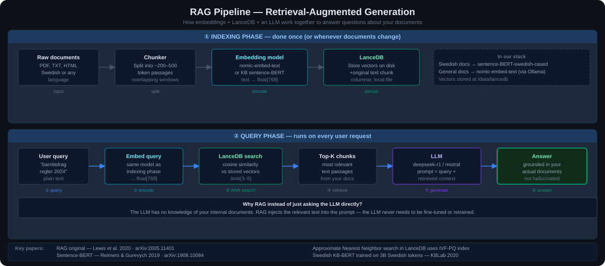
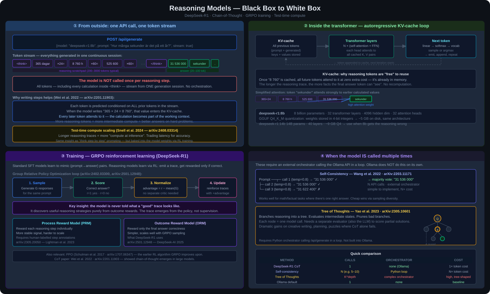
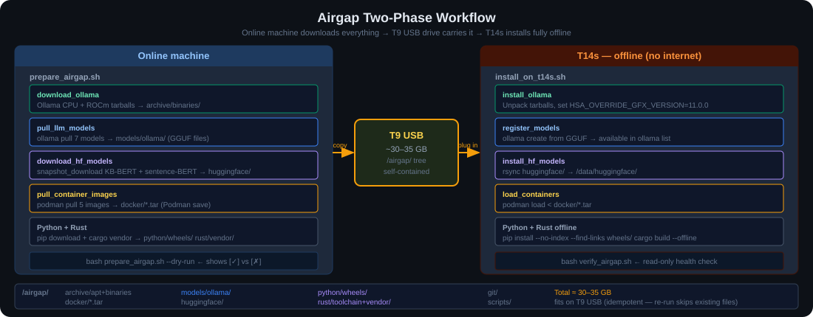

# AIRGAP PAKET — T14s (AMD Ryzen AI 300 / Radeon 890M)


---

## Embeddings — what they are and why we use them



An embedding model converts text into a list of numbers (a vector). Similar meaning → similar numbers. This lets you search by *meaning* rather than exact keywords.

```python
# "hund" and "valp" end up close together in vector space
# "hund" and "skatteverket" end up far apart

from sentence_transformers import SentenceTransformer
model = SentenceTransformer("/data/huggingface/KBLab_sentence-bert-swedish-cased")

vectors = model.encode(["En hund springer", "En valp leker", "Inkomstdeklaration"])
# vectors[0] ≈ vectors[1]  (both about dogs)
# vectors[0] far from vectors[2]  (dog vs tax)
```

We store these vectors in **LanceDB** and search them at query time — this is called **RAG** (Retrieval-Augmented Generation): find the relevant documents first, then feed them to the LLM as context.

```python
import lancedb
from sentence_transformers import SentenceTransformer

model = SentenceTransformer("/data/huggingface/KBLab_sentence-bert-swedish-cased")
db    = lancedb.connect("/data/lancedb")
table = db.open_table("documents")

query_vec = model.encode("barnbidrag regler")
results   = table.search(query_vec).limit(3).to_list()
# → returns the 3 most semantically relevant documents
```

---

## Reasoning models — what "thinking" means

DeepSeek-R1 is a *reasoning* model. Before answering it writes out its thought process (chain-of-thought), then gives a final answer. Slower, but much better on hard problems.

```
ollama run deepseek-r1:8b "Hur många sekunder är det på ett år?"

<think>
Ett år har 365 dagar.
365 × 24 = 8 760 timmar
8 760 × 60 = 525 600 minuter
525 600 × 60 = 31 536 000 sekunder
</think>

Ett år innehåller 31 536 000 sekunder.
```

Use `phi3:mini` or `qwen2.5:3b` for quick chat. Use `deepseek-r1` when the answer requires multi-step logic.

---

## Reasoning models — deep dive (black-box view)



### Is the model called once or many times per response?

**One call. One forward pass. One token stream.**

When you run `ollama run deepseek-r1:8b "..."`, the entire response — including every `<think>` token — is produced in a single autoregressive generation session. There is no orchestrator calling the model once per reasoning step. The model emits tokens one at a time, left to right, until it decides to stop.

```
User prompt
    │
    ▼
┌─────────────────────────────────────────────────────┐
│  Single generation session (one API call)           │
│                                                     │
│  <think>\n                                          │
│  token₁ token₂ token₃ … (reasoning scratchpad)     │
│  </think>\n                                         │
│  token_N token_N+1 … (final answer)                 │
└─────────────────────────────────────────────────────┘
    │
    ▼
Response returned to caller
```

The "steps" inside `<think>` are not separate model invocations — they are just text, generated token by token, that happens to look like structured reasoning.

### Why does writing thoughts help at all?

A transformer predicts each next token conditioned on *all previous tokens*. When the model writes `"365 × 24 = 8 760"`, that calculation literally becomes part of the input context for all subsequent tokens. The reasoning trace is a **working memory scratchpad** built into the token stream itself.

This is called **chain-of-thought (CoT)** prompting and was described formally in:

> Wei et al. (2022) — *Chain-of-Thought Prompting Elicits Reasoning in Large Language Models*
> arXiv:2201.11903

The insight: more tokens = more intermediate computation. A model forced to answer in one token cannot "think"; a model allowed to emit 500 reasoning tokens before the answer has 500 chances to build up the right internal state.

This is a form of **test-time compute scaling** — trading inference time (more tokens) for accuracy:

> Snell et al. (2024) — *Scaling LLM Test-Time Compute Optimally*
> arXiv:2408.03314

### How is a reasoning model trained differently?

A standard chat model is fine-tuned to produce a direct answer. A reasoning model is trained to produce a *reasoning trace + answer*, where the trace is rewarded only if the final answer is correct.

**DeepSeek-R1** uses **GRPO** (Group Relative Policy Optimization), a reinforcement learning algorithm that avoids a separate critic network. The model generates a group of candidate responses, scores them by correctness, and reinforces the ones that led to right answers:

> Shao et al. (2024) — *DeepSeekMath: Pushing the Limits of Mathematical Reasoning in Open Language Models*
> arXiv:2402.03300 (introduces GRPO)

> DeepSeek-AI (2025) — *DeepSeek-R1: Incentivizing Reasoning Capability in LLMs via Reinforcement Learning*
> arXiv:2501.12948 (the R1 model itself)

The reward signal is deliberately outcome-based: the model gets a reward for a *correct final answer*, not for producing a reasoning trace that looks nice. This forces the model to discover internally useful reasoning strategies rather than mimicking surface patterns.

**Process reward models (PRMs)** are an alternative approach — reward each reasoning step individually rather than only the final answer. This is more expensive (humans must label intermediate steps) but reduces the risk of the model "getting lucky" with a wrong chain:

> Lightman et al. (2023) — *Let's Verify Step by Step*
> arXiv:2305.20050

### What actually happens inside the transformer during a reasoning step?

Each token prediction goes through:

```
1. Tokenize all previous tokens (prompt + any already-generated tokens)
2. Embed tokens → vectors
3. Pass through N transformer layers (attention + feed-forward)
   - Multi-head self-attention: each token attends to all previous tokens
   - The KV-cache stores key/value pairs so earlier tokens are not recomputed
4. Final linear layer + softmax → probability distribution over vocabulary
5. Sample (or argmax) → next token
6. Append token, goto 1
```

The KV-cache is why the reasoning trace is "free" to re-use: once `"365 × 24 = 8 760"` is in the cache, future tokens attend to it without recomputing it. The longer the trace, the larger the KV-cache, and the more context each new token has access to.

### What about systems that DO call the model multiple times?

Some frameworks extend CoT by calling the model multiple times and searching over reasoning paths:

**Tree of Thoughts** — branches the reasoning into a tree, evaluates intermediate states, prunes bad branches:

> Yao et al. (2023) — *Tree of Thoughts: Deliberate Problem Solving with Large Language Models*
> arXiv:2305.10601

**Self-consistency** — samples the model N times with temperature > 0, returns the most common final answer (majority vote):

> Wang et al. (2022) — *Self-Consistency Improves Chain of Thought Reasoning in Language Models*
> arXiv:2203.11171

Ollama uses **none** of these by default. When you call `ollama run deepseek-r1:8b`, you get a single greedy (or lightly sampled) generation. For the multi-call search methods you would need an external orchestrator (e.g. LangChain, custom Python) that calls the Ollama REST API in a loop.

### Summary table

| Question | Answer |
|---|---|
| How many API calls per response? | 1 |
| Are reasoning steps separate model calls? | No — they are tokens in the same stream |
| What makes reasoning tokens useful? | They become part of the KV-cache context for subsequent tokens |
| How is it trained? | RL (GRPO) with outcome reward on final answer correctness |
| Can multiple calls improve accuracy? | Yes — Tree of Thoughts / self-consistency, but requires an orchestrator |
| Speed cost vs. plain model? | 3–10× more tokens generated → proportionally slower |

---

## SQL generation

```
ollama run sqlcoder2 "### Database: medborgare(id, namn, kommun, bidragstyp, belopp)
### Question: Visa total utbetalt belopp per kommun, sorterat fallande"

SELECT kommun, SUM(belopp) AS total
FROM medborgare
GROUP BY kommun
ORDER BY total DESC;
```

---

## ROCm — GPU acceleration for AMD

ROCm is AMD's GPU compute platform (equivalent to NVIDIA's CUDA). It is **not** a model format — the same GGUF file runs on CPU or GPU. ROCm just makes it faster.

```bash
# Check if Ollama is using the GPU
ollama ps
# NAME              ID    SIZE   PROCESSOR  UNTIL
# deepseek-r1:8b    ...   5 GB   100% GPU   ...  ← ROCm working
# deepseek-r1:8b    ...   5 GB   100% CPU   ...  ← CPU fallback

# If GPU not detected, force the gfx version and restart
export HSA_OVERRIDE_GFX_VERSION=11.0.0
sudo systemctl restart ollama
```

Without ROCm: ~3–10 tokens/sec. With ROCm on Radeon 890M: ~30–60 tokens/sec.

---

## Installation workflow



## Katalogstruktur
```
/airgap/
├── rust/
│   ├── toolchain/          Rust toolchain (rustup-init + .tar.xz)
│   └── vendor/             Alla Cargo crates (offline build)
├── python/
│   ├── wheels/             Python .whl filer
│   └── requirements_offline.txt
├── models/
│   └── ollama/             GGUF-filer (DeepSeek-R1, Mistral, SQLCoder)
├── huggingface/            KB-BERT, Sentence-BERT
├── archive/
│   ├── apt/                .deb paket
│   └── binaries/           DuckDB, Ollama, pqrs
├── docker/                 .tar Docker images
└── scripts/
    ├── prepare_airgap.sh   ← Kör på online-maskin (laddar ner allt)
    ├── install_on_t14s.sh  ← Kör på T14s (installerar offline)
    └── verify_airgap.sh    ← Verifiera installation
```

## Installation på T14s (offline)
```bash
sudo bash /media/rickard/T9/airgap_llm/scripts/install_on_t14s.sh
```

## Verifiera
```bash
bash /media/rickard/T9/airgap_llm/scripts/verify_airgap.sh
```

## ROCm för AMD 890M (gfx1150)
```bash
# Om Ollama inte hittar GPU:n:
export HSA_OVERRIDE_GFX_VERSION=11.0.0
ollama serve
```

## Snabbtest efter installation
```bash
# Test 1: Ollama SQL-generering
ollama run deepseek-r1:14b "Generera SQL: visa alla medborgare med barnbidrag"

# Test 2: Python Arrow + DuckDB
python3 -c "
import duckdb, pyarrow as pa
db = duckdb.connect()
db.execute('CREATE TABLE test AS SELECT 1 AS id, 42.0 AS val')
print(db.execute('SELECT * FROM test').arrow())
print('Arrow + DuckDB: OK')
"

# Test 3: LanceDB
python3 -c "
import lancedb, numpy as np
db = lancedb.connect('/tmp/test_lance')
db.create_table('test', [{'vector': np.random.rand(128).tolist(), 'text': 'hej'}])
print('LanceDB: OK')
"

# Test 4: Rust build
cd /tmp && cargo new test_rust && cd test_rust
cargo build --release
echo "Rust: OK"
```

## Storlek (ungefärlig)
- Rust toolchain:      ~500 MB
- Cargo vendor:        ~2-4 GB
- Python wheels:       ~3-5 GB (varav torch ~2 GB)
- LLM-modeller (GGUF): ~20 GB (DeepSeek-R1 14B + Mistral + SQLCoder)
- HuggingFace:         ~2 GB
- Docker images:       ~3 GB
- APT-paket:           ~500 MB
- TOTALT:              ~30-35 GB
