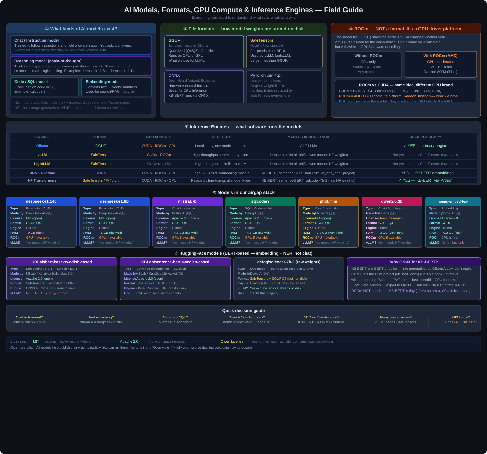

# AIRGAP PAKET — T14s (AMD Ryzen AI 300 / Radeon 890M)



---

## Embeddings — what they are and why we use them

An embedding model converts text into a list of numbers (a vector). Similar meaning → similar numbers. This lets you search by *meaning* rather than exact keywords.

```python
# "hund" and "valp" end up close together in vector space
# "hund" and "skatteverket" end up far apart

from sentence_transformers import SentenceTransformer
model = SentenceTransformer("/data/huggingface/KBLab_sentence-bert-swedish-cased")

vectors = model.encode(["En hund springer", "En valp leker", "Inkomstdeklaration"])
# vectors[0] ≈ vectors[1]  (both about dogs)
# vectors[0] far from vectors[2]  (dog vs tax)
```

We store these vectors in **LanceDB** and search them at query time — this is called **RAG** (Retrieval-Augmented Generation): find the relevant documents first, then feed them to the LLM as context.

```python
import lancedb
from sentence_transformers import SentenceTransformer

model = SentenceTransformer("/data/huggingface/KBLab_sentence-bert-swedish-cased")
db    = lancedb.connect("/data/lancedb")
table = db.open_table("documents")

query_vec = model.encode("barnbidrag regler")
results   = table.search(query_vec).limit(3).to_list()
# → returns the 3 most semantically relevant documents
```

---

## Reasoning models — what "thinking" means

DeepSeek-R1 is a *reasoning* model. Before answering it writes out its thought process (chain-of-thought), then gives a final answer. Slower, but much better on hard problems.

```
ollama run deepseek-r1:8b "Hur många sekunder är det på ett år?"

<think>
Ett år har 365 dagar.
365 × 24 = 8 760 timmar
8 760 × 60 = 525 600 minuter
525 600 × 60 = 31 536 000 sekunder
</think>

Ett år innehåller 31 536 000 sekunder.
```

Use `phi3:mini` or `qwen2.5:3b` for quick chat. Use `deepseek-r1` when the answer requires multi-step logic.

---

## SQL generation

```
ollama run sqlcoder2 "### Database: medborgare(id, namn, kommun, bidragstyp, belopp)
### Question: Visa total utbetalt belopp per kommun, sorterat fallande"

SELECT kommun, SUM(belopp) AS total
FROM medborgare
GROUP BY kommun
ORDER BY total DESC;
```

---

## ROCm — GPU acceleration for AMD

ROCm is AMD's GPU compute platform (equivalent to NVIDIA's CUDA). It is **not** a model format — the same GGUF file runs on CPU or GPU. ROCm just makes it faster.

```bash
# Check if Ollama is using the GPU
ollama ps
# NAME              ID    SIZE   PROCESSOR  UNTIL
# deepseek-r1:8b    ...   5 GB   100% GPU   ...  ← ROCm working
# deepseek-r1:8b    ...   5 GB   100% CPU   ...  ← CPU fallback

# If GPU not detected, force the gfx version and restart
export HSA_OVERRIDE_GFX_VERSION=11.0.0
sudo systemctl restart ollama
```

Without ROCm: ~3–10 tokens/sec. With ROCm on Radeon 890M: ~30–60 tokens/sec.

---

## Katalogstruktur
```
/airgap/
├── rust/
│   ├── toolchain/          Rust toolchain (rustup-init + .tar.xz)
│   └── vendor/             Alla Cargo crates (offline build)
├── python/
│   ├── wheels/             Python .whl filer
│   └── requirements_offline.txt
├── models/
│   └── ollama/             GGUF-filer (DeepSeek-R1, Mistral, SQLCoder)
├── huggingface/            KB-BERT, Sentence-BERT
├── archive/
│   ├── apt/                .deb paket
│   └── binaries/           DuckDB, Ollama, pqrs
├── docker/                 .tar Docker images
└── scripts/
    ├── prepare_airgap.sh   ← Kör på online-maskin (laddar ner allt)
    ├── install_on_t14s.sh  ← Kör på T14s (installerar offline)
    └── verify_airgap.sh    ← Verifiera installation
```

## Installation på T14s (offline)
```bash
sudo bash /media/rickard/T9/airgap_llm/scripts/install_on_t14s.sh
```

## Verifiera
```bash
bash /media/rickard/T9/airgap_llm/scripts/verify_airgap.sh
```

## ROCm för AMD 890M (gfx1150)
```bash
# Om Ollama inte hittar GPU:n:
export HSA_OVERRIDE_GFX_VERSION=11.0.0
ollama serve
```

## Snabbtest efter installation
```bash
# Test 1: Ollama SQL-generering
ollama run deepseek-r1:14b "Generera SQL: visa alla medborgare med barnbidrag"

# Test 2: Python Arrow + DuckDB
python3 -c "
import duckdb, pyarrow as pa
db = duckdb.connect()
db.execute('CREATE TABLE test AS SELECT 1 AS id, 42.0 AS val')
print(db.execute('SELECT * FROM test').arrow())
print('Arrow + DuckDB: OK')
"

# Test 3: LanceDB
python3 -c "
import lancedb, numpy as np
db = lancedb.connect('/tmp/test_lance')
db.create_table('test', [{'vector': np.random.rand(128).tolist(), 'text': 'hej'}])
print('LanceDB: OK')
"

# Test 4: Rust build
cd /tmp && cargo new test_rust && cd test_rust
cargo build --release
echo "Rust: OK"
```

## Storlek (ungefärlig)
- Rust toolchain:      ~500 MB
- Cargo vendor:        ~2-4 GB
- Python wheels:       ~3-5 GB (varav torch ~2 GB)
- LLM-modeller (GGUF): ~20 GB (DeepSeek-R1 14B + Mistral + SQLCoder)
- HuggingFace:         ~2 GB
- Docker images:       ~3 GB
- APT-paket:           ~500 MB
- TOTALT:              ~30-35 GB
